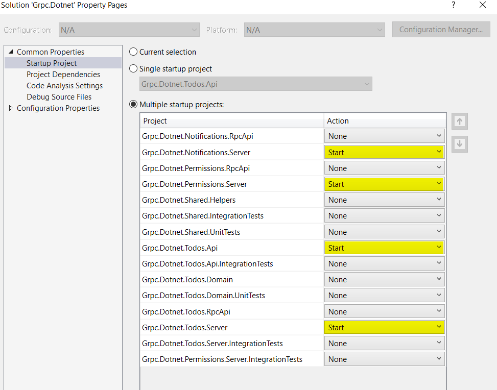

# gRPC .NET Core advanced example
This project was created to demonstrate advanced implementation of .NET Core gRPC services including **unit tests** and **integration tests**

It is created as a set of microsevices communicating via gRPC.

The entrypoint is `Grpc.Dotnet.Todos.Api` REST API with a single `TodoController`.

## Overview

This project is using [MediatR](https://github.com/jbogard/MediatR), [AutoMapper](https://automapper.org/), `EntityFramework Core InMemory`, custom `MessageOrchestrator` and custom `IServiceClient` wrapper.

It also shows how to create **unit tests**, **integration test** and **mock** gRPC clients.

There is also a custom configuration for gRPC ports that `*.Server` projects are starting on: in the `appsettings.json`, there is `RpcServer:Port` value, which is used inside the `Program.cs` by extensions method `webBuilder.ConfigureGrpcServer()`

### MediatR
 [MediatR](https://github.com/jbogard/MediatR) for bussiness logic and calling external gRPC services.

### AutoMapper
[AutoMapper](https://automapper.org/) for auto-mapping gRPC request/response classes to MediatR commands/queries and DTO results. It is also used for [.ProjectTo()](https://docs.automapper.org/en/latest/Queryable-Extensions.html) in `EntityFramework Core InMemory`

### MessageOrchestrator
The `MessageOrchestrator` is used in the implementation of gRPC services, e.g. `PermissionsServiceV1` and is responsible for mapping (AutoMapper) incomming gRPC request into MediatR query/command and invoking corresponding handler. This is a convenient way of automated calling MediatR handlers based on AutoMapper configuration.

### IServiceClient<>

There is a custom implementation for gRPC clients which are wrapped in `IServiceClient` to easly add them to project and then mock them in unit tests or integration tests.

To add a gRPC client, e.g. `XMyGrpcService` to project:
1. add reference to `XMyGrpcService.RpcApi` project.
2. in the `Startup.ConfigureServices()` add `services.AddRpcClients(this.Configuration).AddClient<XMyGrpcService.XMyGrpcServiceClient>()`
3. in the `appsettings.json` add section:
```
"RpcClients": {
    "XMyGrpcServiceClient": {
      "Host": "127.0.0.1",
      "Port": "44444"
    }
  }
```
The `XMyGrpcServiceClient` configuration name must be the same as your generated gRPC client name class from `XMyGrpcService.RpcApi` project.


## Workflow

1. HTTP request goes to `Todos.Api`
2. The request is mapped to MediatR query or command
3. The query or command is then processed by a MeditaR handler
4. The handler checks permissions by calling `Grpc.Dotnet.Permissions.Server` gRPC server.
5. The handler optionally send a request to gRPC server `Grpc.Dotnet.Notifications.Server` 


## Startup

### Run multiple projects
#### 1. From command line:
```
cd <this repo directory>

dotnet run --project .\src\Notifications\Grpc.Dotnet.Notifications.Server\Grpc.Dotnet.Notifications.Server.csproj

dotnet run --project .\src\Permissions\Grpc.Dotnet.Permissions.Server\Grpc.Dotnet.Permissions.Server.csproj

dotnet run --project .\src\Todos\Grpc.Dotnet.Todos.Api\Grpc.Dotnet.Todos.Api.csproj

dotnet run --project .\src\Todos\Grpc.Dotnet.Todos.Server\Grpc.Dotnet.Todos.Server.csproj
```
#### 2. From Visual Studio:


### Test HTTP api (Todos.Api)
1. Install recommended VSCode extension [REST Client](https://marketplace.visualstudio.com/items?itemName=humao.rest-client): `humao.rest-client` and open `<this repo directory>\test-api.http` to make some test requests.
2. Or use Postman and create requests to http://localhost:5000/api/todos/[...]

### Test gRPC requests
Recommended and easy to use tool is [BloomRPC](https://github.com/uw-labs/bloomrpc)
